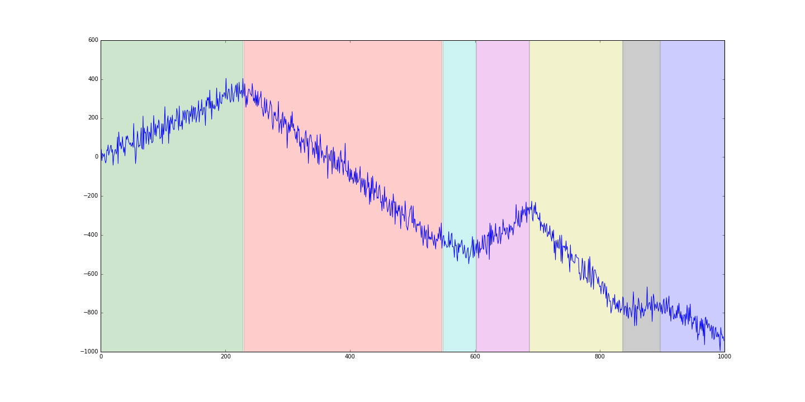

# Install
Après l'avoir téléchargé, dans le dossier du paquet:

> python3 setup.py develop

# Algos de détection de ruptures:

Les methodes de détections de ruptures sont séparées selon la méthode de parcours de l'espace des partitions.

1. Programmation dynamique. Fonctions de coût:
    * [x] erreur quadratique, constant par morceaux
    * [x] erreur quadratique, constant par morceaux (version avec noyau)
    * [x] erreur quadratique, sinusoïde
    * [ ] erreur quadratique, linéaire par morceaux

2. PELT. Fonctions de coût:
    * [x] vraissemblance gaussienne (variance constante)
    * [ ] vraissemblance gaussienne (moyenne et variance variable)
    * [ ] erreur quadratique, constant par morceaux
    * [ ] erreur quadratique, linéaire par morceaux

3. Régressions pénalisées. Pénalités:
    * [ ] fused lasso (équivalent à PELT constant par morceau)
    * [ ] fused rigde
    * [x] pénalité L_0 (équivalent à PELT constant par morceau)

# Utilisation
Chaque algorithme sera une classe avec une méthode "fit" pour calculer la segmentation.
Des exemples d'utilisation existent dans le dossier **tests/**

```python
import matplotlib.pyplot as plt
from ruptures.datasets import pw_constant, pw_linear
from ruptures.show import display
n_samples = 1000 # nombre de points
dim = 3  # dimension du signal
n_regimes = 7  # nombre de régimes
min_size = 50  # taille minimale de segment
snr = 0.1  # signal to noise ratio: 0 --> pas de bruit.
# Constant par morceaux
# signal: le signal (array), chg: liste contenant les fins de chaque régime.
signal, chg = pw_constant(n=n_samples, clusters=n_regimes, dim=dim, min_size=min_size, noisy=True, snr=snr)
fig, ax = display(signal, chg)
plt.show()
```


```python
# Linéaire par morceaux
signal, bkps = pw_linear(n=n_samples, clusters=n_regimes, dim=dim, min_size=min_size, noisy=True, snr=snr)
fig, ax = display(signal, chg)
plt.show()
print(bkps)
# > [ 293  385  471  639  705  947 1000]
```



Pour détecter des ruptures, on choisit un algorithme de parcours des partitions et une fonction de coût:

```python
from ruptures.costs import ConstantMSE, GaussMLE, LinearMLE, KernelMSE

p = LinearMLE("pelt")  # PELT
d = LinearMLE("dynp")  # Dynamic programming
p.fit(signal, penalty=10 * dim, jump=2, min_size=5)

fig, axarr = display(signal[:, 0], bkps, p.bkps)
axarr[0].set_title("True: ({} ruptures) {}. Found: ({} ruptures) {} ".format(len(bkps), bkps, len(p.bkps), p.bkps
```


```python
# Programmation dynamique, avec un noyau gaussien.
d = KernelMSE(method="dynp", kernel="rbf")
d.fit(signal, jump=3, min_size=4, n_regimes=n_regimes)

# On ne montre que les premières dimensions
fig, axarr = display(signal[:,:3], bkps, d.bkps)
axarr[0].set_title("True: ({} ruptures) {}. Found: ({} ruptures) {} ".format(len(bkps), bkps, len(d.bkps), d.bkps))
plt.show()
```


(Les kernels disponibles sont: 'rbf', 'laplacian', 'cosine', 'linear')
