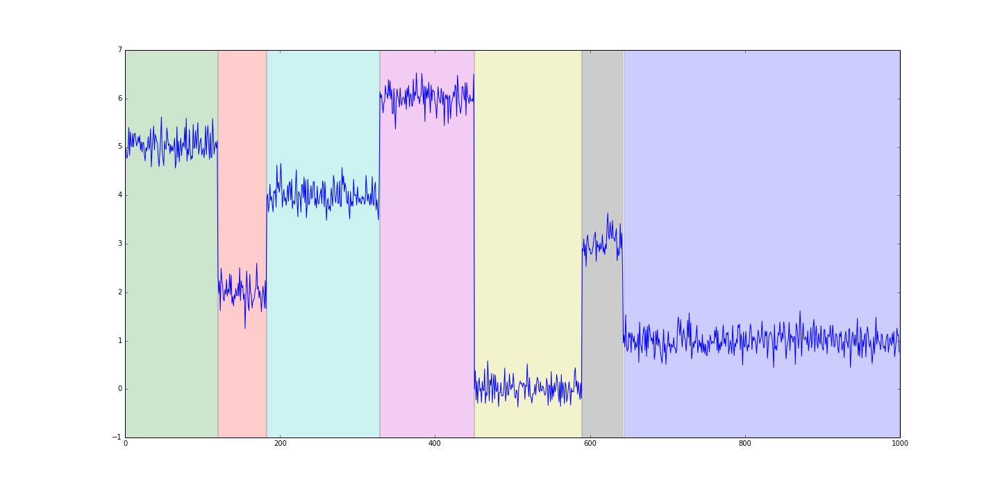

## Install
Download package and inside the folder:
> python3 setup.py install

or
> python3 setup.py develop

## Algorithmes
* [x] nombre de ruptures connu: *_dynp_* (dynamic programming)
* [x] nombre de ruptures inconnu: *_pelt_* (méthode penalisée)

## Modèles de régime
* [x] Constant par morceaux:
  * erreur L1
  * erreur L2
  * vraisemblance gaussienne
* [x] Linéaire par morceaux:
  * erreur L2
  * vraisemblance gaussienne
* [x] Périodique par morceaux:
  * erreur L2
* [x] i.i.d par morceaux:
  * erreur L2 dans RKHS (Les kernels disponibles sont: 'rbf', 'laplacian', 'cosine', 'linear'.)

TODO: finir le README

## Utilisation
Chaque algorithme sera une classe avec une méthode "fit" pour calculer la segmentation.
Des exemples d'utilisation existent dans le dossier **tests/**

```python
import matplotlib.pyplot as plt
from ruptures.datasets import pw_constant
from ruptures.show import display
n_samples = 1000 # nombre de points
dim = 3  # dimension du signal
n_bkps = 7  # nombre de ruptures
# Constant par morceaux
signal, bkps = pw_constant(n_samples, dim, n_bkps, noise_std=2, delta=(1, 2))
fig, ax = display(signal, chg)
plt.show()
print(bkps)
# > [196, 281, 368, 572, 746, 818, 916, 1000]
```


Pour détecter des ruptures, on choisit un algorithme de parcours des partitions et une fonction de coût:

```python
from ruptures.search_methods import Dynp, Pelt, Binseg, Omp, BottomUp

model = "l2"  # or "l1" or "rbf"

p = Pelt(model, min_size=2, jump=5).fit(signal)  # pelt method
d = Dynp(model, min_size=2, jump=5).fit(signal)  # dynamic programming

my_bkps = d.predict(pen=100)
fig, axarr = display(signal[:, 0], bkps, my_bkps)
```


```python
# Programmation dynamique, avec un noyau gaussien.
d = KernelMSE(method="dynp", kernel="rbf")
d.fit(signal, jump=3, min_size=4, n_regimes=n_regimes)

# On ne montre que les premières dimensions
fig, axarr = display(signal[:,:3], bkps, d.bkps)
axarr[0].set_title("True: ({} ruptures) {}. Found: ({} ruptures) {} ".format(len(bkps), bkps, len(d.bkps), d.bkps))
plt.show()
```


(Les kernels disponibles sont: 'rbf', 'laplacian', 'cosine', 'linear')
