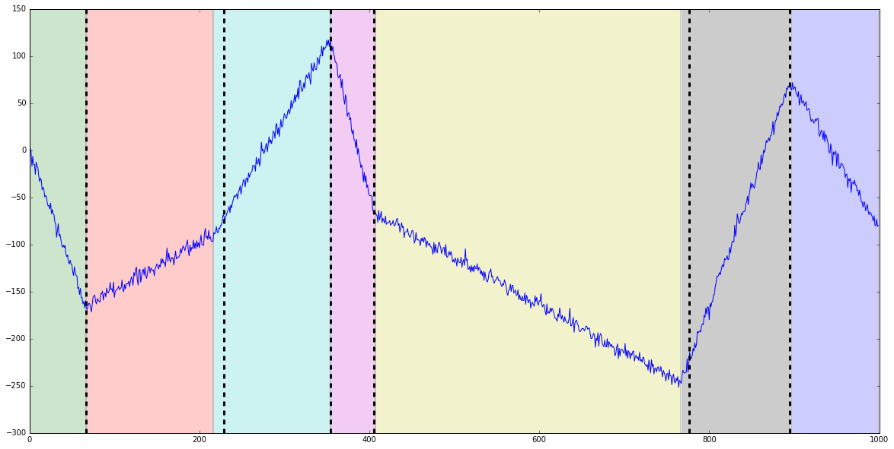

# Install
Après l'avoir téléchargé, dans le dossier du paquet:

> python3 setup.py develop

# Algos de détection de ruptures:

Les methodes de détections de ruptures sont séparées selon la méthode de parcours de l'espace des partitions.

1. Programmation dynamique. Fonctions de coût:
    * [x] erreur quadratique, constant par morceaux
    * [x] erreur quadratique, constant par morceaux (version avec noyau)
    * [x] erreur quadratique, sinusoïde
    * [ ] erreur quadratique, linéaire par morceaux

2. PELT. Fonctions de coût:
    * [x] vraissemblance gaussienne (variance constante)
    * [ ] vraissemblance gaussienne (moyenne et variance variable)
    * [ ] erreur quadratique, constant par morceaux
    * [ ] erreur quadratique, linéaire par morceaux

3. Régressions pénalisées. Pénalités:
    * [ ] fused lasso (équivalent à PELT constant par morceau)
    * [ ] fused rigde
    * [x] pénalité L_0 (équivalent à PELT constant par morceau)

# Utilisation
Chaque algorithme sera une classe avec une méthode "fit" pour calculer la segmentation.
Des exemples d'utilisation existent dans le dossier **tests/**

```python
from ruptures.datasets import pw_constant, pw_linear
from ruptures.show import display
d = 7  # nombre de régimes
n_samples = 1000 # nombre de points
min_size = 50  # taille minimale de segment
snr = 0.1  # signal to noise ratio: 0 --> pas de bruit.
# Constant par morceaux
# signal: le signal (array), chg: liste contenant les débuts de chaque régime.
signal, chg = pw_constant(n=n_samples, clusters=d, min_size=min_size, noisy=True, snr=snr)
fig, ax = display(signal, chg)
```


```python
# Linéaire par morceaux
signal, chg = pw_linear(n=n_samples, clusters=d, min_size=min_size, noisy=True, snr=snr)
fig, ax = display(signal, chg)
```


Pour détecter des ruptures, on choisit un algorithme de parcours des partitions et une fonction de coût:

```python
# Constant par morceaux
# fonction de coût: - log likelihood de variables gaussiennes iid.
from ruptures.costs import gaussmean
from ruptures.dynamic_programming import dynp
func_to_minimize = gaussmean(signal)

# taille minimale de segment
min_size = 2
jump = 10  # on calcule les ruptures que tous les jump points (pour accélérer les calculs).
# par programmation dynamique
dp = dynp(error_func=func_to_minimize, n=n_samples, n_regimes=d,
               min_size=min_size, jump=jump)
r = dp.fit()
print(r)
# > [0, 120, 180, 330, 450, 590, 650]
# on peut ensuite afficher les ruptures
display(signal, chg, r)
```


```python
# Linéaire par morceaux, avec Pelt
# fonction de coût: - log likelihood de variables gaussiennes iid.
from ruptures.costs import linear_mse
from ruptures.pelt import Pelt

func_to_minimize = linear_mse(signal)

# taille minimale de segment
min_size = 10
penalty = 1 # pelt a besoin d'une pénalité linéaire.

# Pelt
pl = Pelt(error_func=func_to_minimize, n=n_samples, penalty=penalty,
               min_size=min_size)
r = pl.fit()
print(r)
# > [0, 67, 229, 354, 405, 776, 895]

# on peut ensuite afficher les ruptures
fig, ax = display(signal, chg, r)
```


