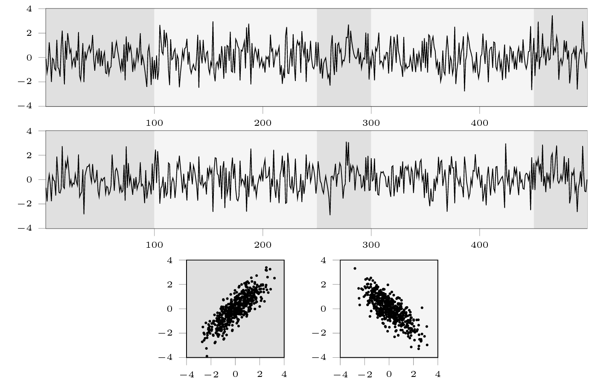

# Piecewise 2D Gaussian process (`pw_normal`)

## Description

The function [`pw_normal`][ruptures.datasets.pw_normal.pw_normal] simulates a 2D signal of Gaussian i.i.d. random variables with zero mean and covariance matrix alternating between $[[1, 0.9], [0.9, 1]]$ and $[[1, -0.9], [-0.9, 1]]$ at every change point.


<center><i>Top and middle: 2D signal example. Bottom: Scatter plot for each regime type</i></center>

## Usage

Start with the usual imports and create a signal.

```python
import numpy as np
import matplotlib.pylab as plt
import ruptures as rpt

# creation of data
n = 500  # number of samples
n_bkps = 3  # number of change points
signal, bkps = rpt.pw_normal(n, n_bkps)
rpt.display(signal, bkps)
```