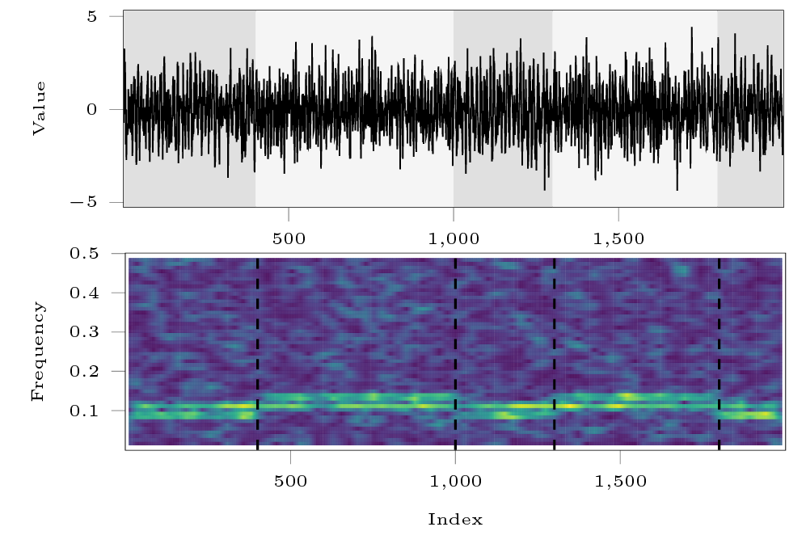

# Piecewise sinusoidal signal (`pw_wavy`)

## Description

The function [`pw_wavy`][ruptures.datasets.pw_wavy.pw_wavy] simulates a sum-of-sine signal $y_t=\sin(2\pi f_1 t)+\sin(2\pi f_2 t)$ where $t=0,\dots,T-1$.
The frequency vector $[f_1, f_2]$ alternates between $[0.075, 0.1]$ and $[0.1, 0.125]$ at each change point index.
Gaussian white noise can be added to the signal.


<center><i>Top: signal example. Bottom: associated spectrogram.</i></center>

## Usage

Start with the usual imports and create a signal.

```python
import numpy as np
import matplotlib.pylab as plt
import ruptures as rpt

# creation of data
n, dim = 500, 3  # number of samples, dimension
n_bkps, sigma = 3, 5  # number of change points, noise standart deviation
signal, bkps = rpt.pw_wavy(n, n_bkps, noise_std=sigma)
rpt.display(signal, bkps)
```