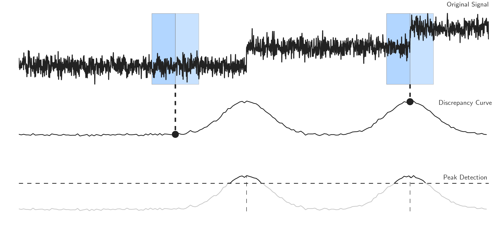

# Window-based change point detection (`Window`)

## Description

Window-based change point detection is used to perform fast signal segmentation and is implemented in [`Window`][ruptures.detection.window.Window].
The algorithm uses two windows which slide along the data stream.
The statistical properties of the signals within each window are compared with a discrepancy measure.
For a given cost function $c(\cdot)$, a discrepancy measure is derived $d(\cdot,\cdot)$ as follows:

$$
d(y_{u..v}, y_{v..w}) = c(y_{u..w}) - c(y_{u..v}) - c(y_{v..w})
$$

where $\{y_t\}_t$ is the input signal and $u < v < w$ are indexes.
The discrepancy is the cost gain of splitting the sub-signal $y_{u..w}$ at the index $v$.
If the sliding windows $u..v$ and $v..w$ both fall into a segment, their statistical properties are similar and the discrepancy between the first window and the second window is low.
If the sliding windows fall into two dissimilar segments, the discrepancy is significantly higher, suggesting that the boundary between windows is a change point.
The discrepancy curve is the curve, defined for all indexes $t$ between $w/2$ and $n-w/2$ ($n$ is the number of samples),

$$
\big(t, d(y_{t-w/2..t}, y_{t..t+w/2})\big)
$$

where $w$ is the window length.
A sequential peak search is performed on the discrepancy curve in order to detect change points.

The benefits of window-based segmentation includes low complexity (of the order of $\mathcal{O}(n w)$, where $n$ is the number of samples), the fact that it can extend any single change point detection method to detect multiple changes points and that it can work whether the number of regimes is known beforehand or not.


<center><i>Schematic view of the window sliding segmentation algorithm</i></center>

## Usage

Start with the usual imports and create a signal.

```python
import numpy as np
import matplotlib.pylab as plt
import ruptures as rpt

# creation of data
n, dim = 500, 3  # number of samples, dimension
n_bkps, sigma = 3, 5  # number of change points, noise standart deviation
signal, bkps = rpt.pw_constant(n, dim, n_bkps, noise_std=sigma)
```

To perform a binary segmentation of a signal, initialize a [`Window`][ruptures.detection.window.Window]
instance.

```python
# change point detection
model = "l2"  # "l1", "rbf", "linear", "normal", "ar"
algo = rpt.Window(width=40, model=model).fit(signal)
my_bkps = algo.predict(n_bkps=3)

# show results
rpt.show.display(signal, bkps, my_bkps, figsize=(10, 6))
plt.show()
```

The window length (in number of samples) is modified through the argument `width`.
Usual methods assume that the window length is smaller than the smallest regime length.

In the situation in which the number of change points is unknown, one can specify a penalty using
the `pen` parameter or a threshold on the residual norm using `epsilon`.

```python
my_bkps = algo.predict(pen=np.log(n) * dim * sigma**2)
# or
my_bkps = algo.predict(epsilon=3 * n * sigma**2)
```

For faster predictions, one can modify the `jump` parameter during initialization.
The higher it is, the faster the prediction is achieved (at the expense of precision).

```python
algo = rpt.Window(model=model, jump=10).fit(signal)
```