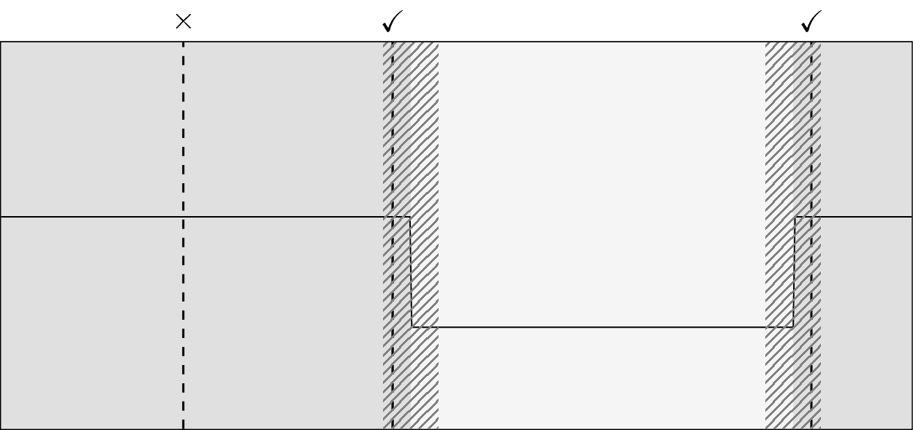

# Precision and recall (`precision_recall`)

## Description

The precision and recall of an estimated segmentation is computed by the function [`precision_recall`][ruptures.metrics.precisionrecall.precision_recall] as follows.
A true change point is declared "detected" (or positive) if there is at least one computed change point at less than "margin" points from it.
Formally, assume a set of change point indexes $t_1,t_2,\dots$ and their estimates $\hat{t}_1, \hat{t}_2,\dots$
In the context of change point detection, precision and recall are defined as follows:

$$
\text{precision}:=|\text{TP}|/|\{\hat{t}_l\}_l| \quad \text{and}\quad\text{recall}:=|\text{TP}|/|\{t_k\}_k|
$$

where, for a given margin $M$, true positives $\text{TP}$ are true change points for which there is an estimated one at less than $M$ samples, i.e.

$$
\text{TP}:= \{t_k\,|\, \exists\, \hat{t}_l\,\, \text{s.t.}\, |\hat{t}_l - t_k|<M \}.
$$


<center><i>Schematic example: true segmentation in gray, estimated segmentation in dashed lines and margin in dashed areas. Here, precision is 2/3 and recall is 2/2.</i></center>

## Usage

Start with the usual imports and create two change point sets to compare.

```python
from ruptures.metrics import precision_recall

bkps1, bkps2 = [100, 200, 500], [105, 115, 350, 400, 500]
p, r = precision_recall(bkps1, bkps2)
print((p, r))
```

The margin parameter $M$ can be changed through the keyword `margin` (default is 10 samples).

```python
p, r = precision_recall(bkps1, bkps2, margin=10)
print((p, r))
p, r = precision_recall(bkps1, bkps2, margin=20)
print((p, r))
```