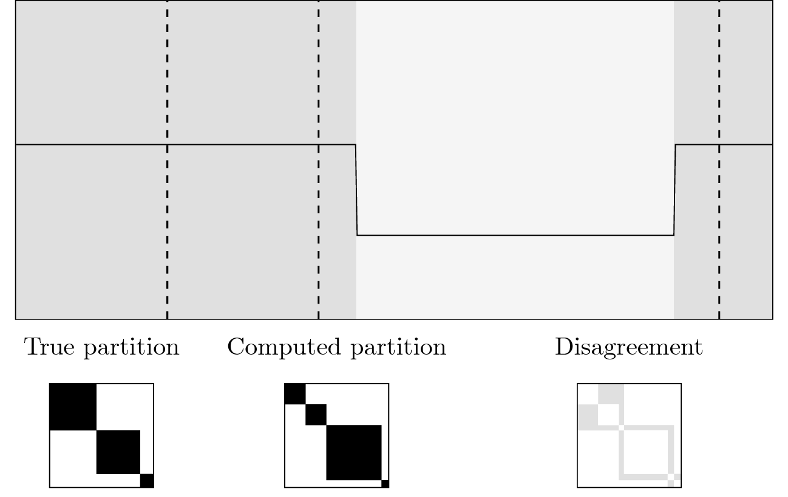

# Rand index (`randindex`)

## Description

The Rand index, computed by the [`randindex`][ruptures.metrics.randindex.randindex] function, measures the similarity between two segmentations.
Formally, for a signal $\{y_t\}_t$ and a segmentation $\mathcal{S}$, denote by $A$ the associated membership matrix:

$$
\begin{aligned} \mathcal{A}_{ij} &= 1 \text{ if both samples } y_i \text{ and } y_j \text{ are in the same segment according to } \mathcal{S} \\ &= 0 \quad\text{otherwise} \end{aligned}
$$

Let $\hat{\mathcal{S}}$ be the estimated segmentation and $\hat{A}$, the associated membership matrix.
Then the Rand index is equal to

$$
\frac{\sum_{i<j} \mathbb{1}(A_{ij} = \hat{A}_{ij})}{T(T-1)/2}
$$

where $T$ is the number of samples.
It has a value between 0 and 1: 0 indicates that the two segmentations do not agree on any pair of points and 1 indicates that the two segmentations are exactly the same.


<center><i>Schematic example: true segmentation in gray, estimated segmentation in dashed lines and their associated membership matrices. Rand index is equal to 1 minus the gray area.</i></center>

## Usage

Start with the usual imports and create two segmentations to compare.

```python
from ruptures.metrics import randindex

bkps1, bkps2 = [100, 200, 500], [105, 115, 350, 400, 500]
print(randindex(bkps1, bkps2))
```