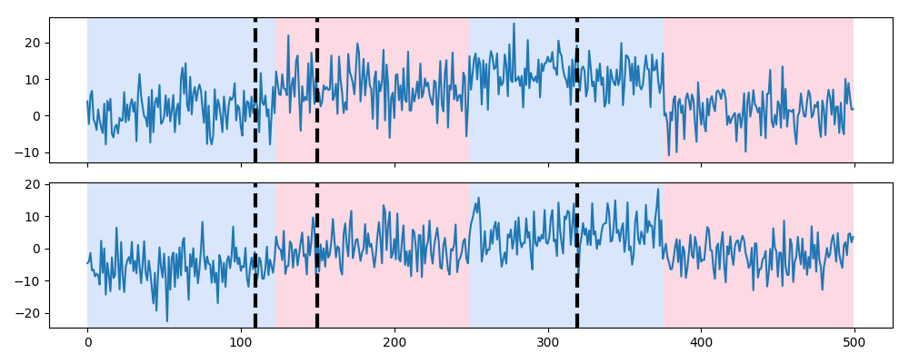

# Display (`display`)

## Description

The function [`display`][ruptures.show.display.display] displays a signal and the change points provided in alternating colors.
If another set of change point indexes is provided, they are displayed with dashed vertical dashed lines.

## Usage

Start with the usual imports and create a signal.

```python
import numpy as np
import matplotlib.pylab as plt
import ruptures as rpt

# creation of data
n, dim = 500, 2  # number of samples, dimension
n_bkps, sigma = 3, 5  # number of change points, noise standart deviation
signal, bkps = rpt.pw_constant(n, dim, n_bkps, noise_std=sigma)
rpt.display(signal, bkps)
```

If we computed another set of change points, for instance `[110, 150, 320, 500]`, we can easily compare the two segmentations.

```python
rpt.display(signal, bkps, [110, 150, 320, 500])
```


<center><i>Example output of the function [`display`][ruptures.show.display.display].</i></center>